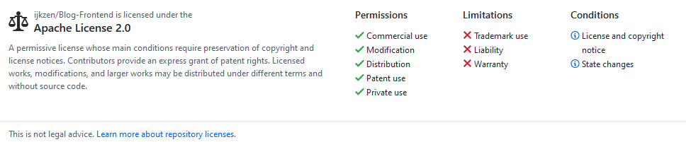

<h1 align="center">Blog-Frontend</h1>
<div align="center"> 
    A modern personal blog written by angular
    <br>
	
	
	
	
	

## ✨ Features

- Log in through `Github`, and all articles and assets stored at `Github`
- Support `highlight`, [LaTex](https://katex.org/) and [mermaid](https://mermaid-js.github.io/mermaid/#/)
- Send notifications by Email
- Support CDN to speed up image loading
- Allow guest to edit article
- Record user access
- Support SSR to improve SEO

## 📦 Installation

We user `Yarn` as package manager, so install it.
```shell
npm install yarn -g
```
and then resolving packages:
```shell
cd Blog-Frontend
yarn
```
finally, run following command:
```shell
yarn run start
```
## Preview
<div align="center">
    
    <br>
    <span>Index Page</span>
</div>

<div align="center">
    
    <br>
    <span>Category Page</span>
</div>

<div align="center">
    
    <br>
    <span>Index Page</span>
</div>

<div align="center">
    
    <br>
    <span>Chat Game</span>
</div>

<div align="center">
    
    <br>
    <span>Search Results</span>
</div>

<div align="center">
    
    <br>
    <span>Diaplay Article</span>
</div>

<div align="center">
    
    <br>
    <span>Edit Online</span>
</div>

<div align="center">
    
    <br>
    <span>Text Diff</span>
</div>

<div align="center">
    
    <br>
    <span>Admin Page</span>
</div>

<div align="center">
    
    <br>
    <span>Configure Email</span>
</div>

<div align="center">
    
    <br>
    <span>Configure CDN</span>
</div>

<div align="center">
    
    <br>
    <span>Manage Article</span>
</div>

<div align="center">
    
    <br>
    <span>Configure Donation</span>
</div>

<div align="center">
    
    <br>
    <span>API Call Count</span>
</div>

<div align="center">
    
    <br>
    <span>IP Location</span>
</div>

## ☀️ License

<div align="center">
    
</div>

