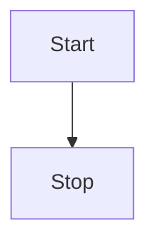

---
算法导论3-2
---

## 读书笔记

> 这一章节主要是回顾了一些关于数学的内容，下面是其中的重要内容。

> **多重函数**
>
> 我们使用记号$f^{(i)}(n)$来表示函数$f(n)$重复$i$次作用于一个初值$n$上。形式化地，假设$f(n)$为实数集上的一个函数。对非负整数$i$，我们递归地定义
>
> 
> $$
> f^{(i)}(n)= \begin{cases}
> n           &若i=0 \\
> f(f^{(i-1)}(n)) & 若i>0
> 
> \end{cases}
> $$
> 
>
> 上述文字表述有一些复杂，简单来说本次函数的输入是**次级函数**的输出，这里次级函数指的是$f^{(i-1)}$，$f^{(i-1)}$的输出又取决于它的次级函数，由此递归至不可分解；

> **多重对数函数**
>
> 
> $$
> \lg^{*}n = min\{i\ge0:\lg^{(i)}n\le1\}
> $$
> 
>
> 定义如上，也就是求取满足条件的$i$的最小值

举个例子：现在求$ \lg^*{16} $，过程如下：

$$
\begin{aligned}
 & \lg{16} = 4   \\
 & \lg{4} = 2  \\
 & \lg{2} = 1 \\
 \end{aligned}
$$

一共代入了三次函数，所以$\lg^*{16}=3$　

> **斐波那契数**
>
> 定义如下：
>
> 
> $$
> F(n) = \begin{cases}
> 0         & n =0 \\
> 1          & n=1 \\
> F(n-1)+F(n-2) & n\ge 2
> \end{cases}
> $$
> 
>
> 注意此处的$n$皆为非负整数；
>
> 尽管斐波那契数的求取过程是递归的，但是它仍然有同项公式，如下：
>
> 
> $$
> F(n) = \frac{\phi^n -{\bar{\phi}}^n}{\sqrt{5}}
> $$
> 
>
> 此处这两个符号的值为：
>
> 
> $$
> \begin{aligned}
> & \phi = \frac{1+\sqrt{5}}{2} = 1.61803 \\ 
> & {\bar{\phi}} = \frac{1-\sqrt{5}}{2} = -0.61803
> \end{aligned}
> $$
> 
>
> 又因为$\frac{\bar{\phi}^n}{\sqrt{5}}<\frac{1}{\sqrt{5}}<\frac{1}{2}$，所以最终的通项表达式如下：
>
> 
> $$
> F(n) = \lfloor \frac{\phi^{n}}{\sqrt{5}} + \frac{1}{2}\rfloor
> $$
> 

## 课后习题

> 证明： 若$f(n)$和$g(n)$是单调增的函数，则函数$f(n)+g(n)$和$f(g(n))$也是单调增，此外，若$f(n)$和$g(n)$是非负的，则$f(n)*g(n)$也是单调增的；

由两个单调增的函数证明三个新函数的单调性；

**对于$ f(n)+g(n) $**

现有$n_1$和$n_2$，且$n_1<n_2$，因为$f(n)$和$g(n)$都是单调增函数，则有

$$
\begin{aligned}
f(n_1)<f(n_2) \\
g(n_1)<g(n_2)
\end{aligned}
$$

两个不等式相加，则有$f(n_1)+g(n_1)<f(n_2)+g(n_2)$，证毕；

**对于$ f(g(n)) $**

现有$n_1$和$n_2$，且$n_1<n_2$，因为$g(n)$是单调增函数，则有$g(n_1)<g(n_2)$，又因为$f(n)$是单调增函数，所以有

$$
f(g(n_1))<f(g(n_2))
$$

证毕；

**对于$ f(n)*g(n) $**

现有$n_1$和$n_2$，且$n_1<n_2$，因为$f(n)$和$g(n)$都是单调增函数，则有

$$
\begin{aligned}
f(n_1)<f(n_2) \\
g(n_1)<g(n_2)
\end{aligned}
$$

又因为$f(n)$和$g(n)$都是非负函数，不存在相乘后符号变换的问题，所以可以安全的将两个不等式相乘；

$$
f(n_1)*g(n_1)< f(n_2)*g(n_2)
$$

证毕；

> 证明等式 (3.16)

等式3.16：

$$
a^{\log_b{c}} = c^{\log_b{a}}
$$

令$M=\log_b{c}$和$N=\log_b{a}$，则有

$$
c = b^M \\
a = b^N
$$

将等式3.16中的$a和c$用上面的式子替换掉，则有

$$
\begin{aligned}
\color{red}左式： &({b^N})^{\log_b{b^M}} & = ({b^N})^M \\ 
                 &                      & = b^{NM} \\
                      \\
 \color{red}右式： &(b^M)^{\log_b{b^N}}  & = (b^M)^N \\
                  &                     & = b^{MN}
\end{aligned}
$$

左右两边相等，**证毕**；

> 证明等式(3.19)。并证明$ n! = \omega(2^n)且n! = o(n^n) $。

等式3.19：

$$
\lg{(n!)} = \theta{(n\lg{n})}
$$

因为 $n!=n\ast(n-1)\dots\ast2\ast1$ ，所以

$$
\lg{(n!)} = \lg{n} + \lg{(n-1)}+...+\lg2+\lg1
$$

毫无疑问，存在$c\ge1$，对于所有$n>0$，有$0\le{\lg{(n!})}\le{cn\lg{n}}$成立，即$\lg{n!}=o(n\lg{n})$；

以此同时，存在$c\rightarrow0$，对于所有$n>0$，有$0\le{cn\lg{n}}\le{\lg{(n!)}}$成立，即$\lg{n!}=\omega{(n\lg{n})}$

综上作述，$\lg{n!}=\theta({n\lg{n}})$，证毕；

**对于$ n! = \omega({2^n}) $**

$$
\forall{c>0}, \exists{n_0>0}，使得对所有的n\ge{n_0},有0\le{c2^n}\le{n!}
$$

**证毕**；

**对于 $ n!= o(n^n)$**

$$
\forall{c>0}, \exists{n_0>0}，使得对所有的n\ge{n_0},有0\le{n!}\le{cn^n}
$$

证毕；

> 函数$\lceil{\lg{n}}\rceil !$多项式有界吗？函数$\lceil{\lg{\lg{n}}}\rceil !$多项式有界吗？

对于多项式$f(n)$有界，其具体含义是

$$
存在常数c,k和n_0, 当n\ge{n_0}时, 使得f(n)<cn^k
$$

将不等式两边取对数

$$
\lg{f(n)} < \lg{cn^k} \\
\lg{f(n)} = o(\lg{n})
$$

**对于函数$\lceil{\lg{n}}\rceil {!} $**

$$
\begin{aligned}
f(n) & = \lceil{\lg{n}}\rceil !\\[2ex]
\lg{f(n)} &= \lg{(\lceil\lg{n}\rceil}!) \\[2ex]
          & = \lceil\lg{n}\rceil * \lg{(\lceil\lg{n}\rceil)} > o(\lg{n})
\end{aligned}
$$

所以函数$\lceil\lg{n}\rceil!$没有界；

**对于函数$\lceil{\lg{(\lg{n})}}\rceil!$**

$$
\begin{aligned}
f(n) &= \lceil{\lg{(\lg{n})}}\rceil! \\[2ex]
\lg{f(n)} &= \lg{\lceil{\lg{(\lg{n})}}\rceil!} \\[2ex]
          &=\lceil\lg{(\lg{n})}\rceil * \lg{(\lceil\lg{(\lg{n})}\rceil)} \\[2ex] 
          &=\theta({\lg(\lg{n})}*\lg{(\lg{(\lg{n})})}) \\[2ex]
          &=O(\lg{\lg{n}}*\lg{\lg{n}})\\[2ex]
          &=O(\lg{n})
\end{aligned}
$$

所以函数$\lceil{\lg{(\lg{n})}}\rceil!$有界；

> 如下两个函数，哪一个渐近更大些：$\lg(\lg^{\ast}{n})$还是$\lg^{\ast}{\lg{n}}$?

这道题有点类似$f(n)=\sqrt{n}/2$和$f(n)=\sqrt{n/2}$，毫无疑问是$\color{red}{后者}$大；

> 证明：黄金分割率$\phi$及其共轭数$\bar\phi$都满足方程$x^2=x+1$

初中数学不再赘述；

> 用归纳法证明斐波那契通项公式:
>
> 
> $$
> F_i = \frac{\phi^i-\bar\phi^i}{\sqrt{5}}
> $$

首先

$$
\begin{aligned}& \phi = \frac{1+\sqrt{5}}{2} = 1.61803 \\ & {\bar{\phi}} = \frac{1-\sqrt{5}}{2} = -0.61803\end{aligned}
$$

当$i=1$时，$F_1=\frac{\sqrt{5}}{\sqrt{5}}=1$，成立；

假设当$i=n$时，$F_n=\frac{\phi^n-\bar\phi^n}{\sqrt{5}}$，成立；

当$i=n+1$时，

$$
\begin{aligned}
F_{n+1} &= F_n + F_{n-1} \\[2ex]
        &=\frac{\phi^n-\bar\phi^n}{\sqrt{5}} + \frac{\phi^{n-1}-\bar\phi^{n-1}}{\sqrt{5}} \\[2ex]
        &=\frac{(\phi^n+\phi^{n-1})-(\bar\phi^n+\bar\phi^{n-1})}{\sqrt{5}} \\[2ex]
        &=\frac{\phi^{n+1}-\bar\phi^{n+1}}{\sqrt{5}}
\end{aligned}
$$

**证毕**；

> 证明：$k\ln{k}=\theta(n)蕴含着k=\theta({n/\ln{n}})$。

根据条件：

$$
存在c_1,c_2, 使得c_1n\le{k\ln{k}}\le{c_2n}
$$

$\color{red} {不等式左边}$

两边取对数，

$$
\ln{c_1}+\ln{n}\le{\ln{k}+\ln{(\ln{k})}} \\[2ex]
\ln{n} = O{(\ln{k})}
$$

即存在$c_3$，使得$\ln{n}\le{c_3\ln{k}}$，即$\frac{n}{\ln{n}}\ge\frac{n}{c_3\ln{k}}\ge\frac{k}{c_2c_3}$成立，即$\frac{n}{\ln{n}}=\Omega(k)$;

$\color{red} {不等式右边}$

推导过程同不等式的右边相似，不再赘述；

结论$\frac{n}{\ln{n}}=\theta{(k)}$，由于$\theta$的对称性，得到$k=\theta(\frac{n}{\ln{n}})$;

**证毕**；

